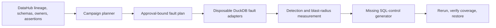

# Lineage Fuzzer

[Open the live judge console](https://fuzzer.datahub-hackathon.aaronmathias.com) ·
[View the source](https://github.com/amathias/lineage-fuzzer) ·
[Follow the under-three-minute recording runbook](docs/JUDGE_DEMO.md)

Demo video: **pending recording and public upload**. The repository does not claim that a video
exists yet.

Lineage Fuzzer is a DataHub-powered semantic chaos agent for data reliability. It reads one exact
six-dataset sandbox graph, predicts downstream impact, injects three deterministic faults into a
disposable DuckDB fixture, measures which cataloged controls detect them, generates the missing
read-only SQL tests, reruns the same campaign, and verifies complete restoration.

## Architecture



## Three-step judge path

1. Open the live console and inspect the exact sandbox graph plus predicted three-fault campaign.
2. Approve and run the deterministic campaign, observing baseline detection coverage of 1/3.
3. Inspect the generated read-only SQL controls, rerun to 3/3 coverage, and verify full restoration.

The judge flow demonstrates:

- six catalog datasets with complete schemas, ownership, domain, project/sandbox tags, and
  `sandbox=true`;
- five exact lineage edges and three persistent baseline custom assertions;
- numeric-scale, partition-staleness, and null-density fault adapters;
- predicted-versus-observed checksum blast radius;
- baseline coverage of 1/3 and improved coverage of 3/3;
- a generated, validated, runnable SQL artifact;
- restoration between every fault and after the campaign; and
- immutable evidence keyed by both manifest and context digests.

## Safety boundary

Fault injection is default-deny. The only mutable physical target is
`demo/fixtures/lineage-fuzzer/lineage_fuzzer.duckdb`, and the only accepted catalog namespace is
`fuzzer.*` on DuckDB/DEV with the exact Lineage Fuzzer domain, owner, tags, and marker. Catalog
seed/reset operations require separate immutable approval digests. Reset soft-deletes only the six
allowlisted datasets and three baseline assertions; the earlier proof assertion, domain, and tags
are outside its delete set.

In `APP_ENV=hackathon`, readiness and the judge campaign additionally require a saved
`datahub-mcp-live` context plus its receipt. The receipt must match the running candidate SHA, the
current verified catalog seed, and the current local fixture checksums. Local fixture topology
cannot become live evidence by changing a source label.

## Local verification

```powershell
python -m venv .venv
.venv\Scripts\python.exe -m pip install -e ".[dev,datahub]"
.venv\Scripts\python.exe -m pytest -q
.venv\Scripts\python.exe -m ruff check .
.venv\Scripts\python.exe scripts\scan_secrets.py
```

Run the offline, explicitly local judge demo:

```powershell
$env:LINEAGE_FUZZER_INJECTION_ENABLED = "true"
.venv\Scripts\python.exe -m lineage_fuzzer.pipeline_cli seed
.venv\Scripts\lineage-fuzzer.exe serve --host 127.0.0.1 --port 8104
```

Open `http://127.0.0.1:8104`. The page remains honest about
`context_source=local-fixture-topology`. See [docs/JUDGE_DEMO.md](docs/JUDGE_DEMO.md) for the
approval-bound live sequence and [COORDINATOR_HANDOFF.md](COORDINATOR_HANDOFF.md) for the current
candidate and preserved proof evidence.

## Reproducible source-package verification

After committing, verify the exact archive rather than the working tree:

```powershell
powershell -ExecutionPolicy Bypass -File scripts\verify_archive.ps1 -Commit HEAD
```

The verifier creates a fresh Git archive, performs a tracked-file secret scan, creates an isolated
environment, installs all pinned dependencies, builds and reinstalls the wheel, checks imports,
runs tests and Ruff, seeds and checks the fixture, and exercises the judge page and plan endpoint.

## Submission

**Title:** Lineage Fuzzer

**Tagline:** Break data safely before bad data breaks production.

**Live application:** [fuzzer.datahub-hackathon.aaronmathias.com](https://fuzzer.datahub-hackathon.aaronmathias.com)

**Public repository:** [github.com/amathias/lineage-fuzzer](https://github.com/amathias/lineage-fuzzer)

The deployed product candidate is live-seeded, live-captured, readiness-verified, and enabled for
the approval-bound judge campaign. The complete expanded campaign and the separate DataHub custom
assertion write/result/re-read/restore proof were coordinator-observed on compatible earlier
candidates and remain distinct restored evidence. See [SUBMISSION.md](SUBMISSION.md) for the
judge-ready Devpost copy and [docs/JUDGE_DEMO.md](docs/JUDGE_DEMO.md) for the exact recording
runbook under three minutes.
